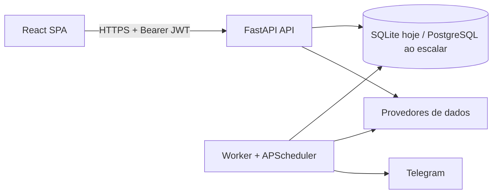

# Arquitetura-alvo e evolução segura

## Decisão

O OneB Market deve permanecer um **monólito modular**. A aplicação já separa API, worker de
automação e front-end; extrair microsserviços agora acrescentaria custo operacional sem evidência
de que uma parte precisa escalar ou ser implantada de forma independente.

## Limites de módulos

| Área | Responsabilidade | Regra de evolução |
|---|---|---|
| `routers/` | HTTP, autenticação e validação de entrada | Não colocar regras de negócio complexas. |
| serviços de domínio | decisão, risco, indicadores, posições e dados | Funções determinísticas e cobertas por testes. |
| `market_data/` | adaptadores de provedores e cache | Nunca expor formato específico do provedor ao restante da aplicação. |
| `scheduler.py` / `worker.py` | orquestração de jobs | Idempotência e logs de falha; sem regra duplicada. |
| `models.py`, `db.py` | persistência | Migrações formais antes de produção multiusuário. |

## Gatilhos para extrair um serviço

Extrair somente se houver ao menos dois sinais: equipe responsável própria, necessidade de escala
independente, ciclos de release incompatíveis, ou um gargalo comprovado por métricas. Candidatos
futuros são coleta de mercado e geração de relatórios; a API transacional deve continuar simples.

## Produção

Use PostgreSQL antes de múltiplas réplicas da API, mantenha somente um worker agendador ativo e
termine TLS/HSTS no proxy. Métricas e logs devem incluir `X-Request-ID` para correlação.
